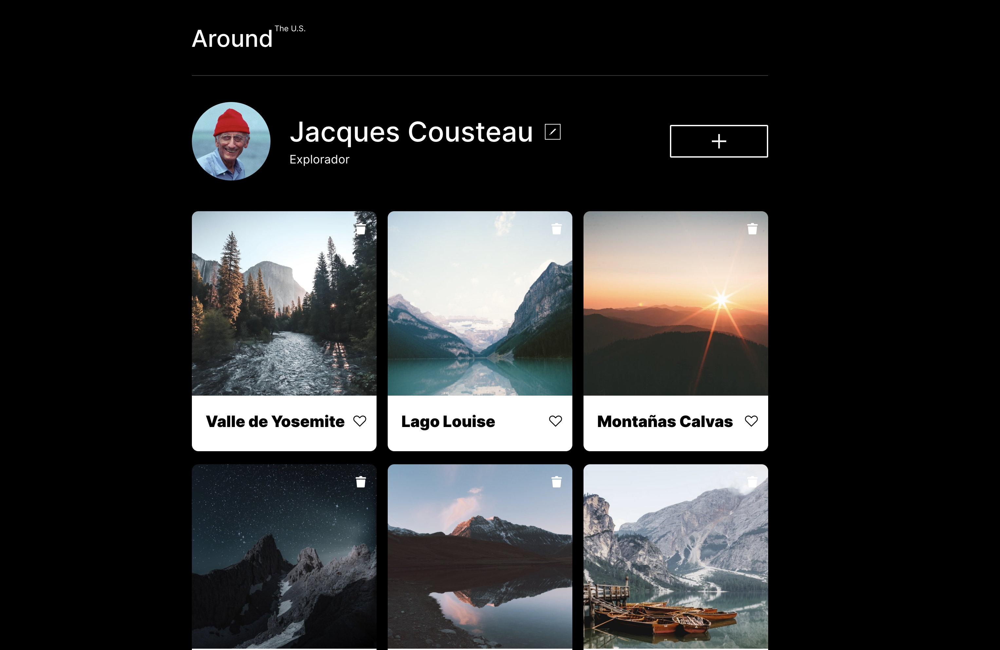

# Tripleten web_project_around_es

Este proyecto es una aplicación web de galerías fotográficas llamada **Around The U.S.** Fue construida durante el Sprint 6 de TripleTen, utilizando únicamente tecnologías web fundamentales: **HTML**, **CSS** y **JavaScript** sin ningún framework.

---

## 🚀 Live Demo

👉 **[View Live Demo](https://ricardotrejosanjuan.github.io/web_project_around_es/)**



---

## Estructura del Proyecto

La **estructura de archivos** es la organización física de todos los archivos que componen una aplicación web. Incluye HTML, CSS, JavaScript, imágenes, fuentes y dependencias.

Este proyecto sigue una estructura modular:

```
web_project_around_es/
├── index.html              # Archivo principal HTML
├── pages/
│   └── index.css         # CSS principal (importa módulos)
├── blocks/              # Módulos CSS individuales
│   ├── page.css
│   ├── header.css
│   ├── profile.css
│   ├── cards.css
│   ├── card.css
│   ├── popup.css
│   ├── content.css
│   └── footer.css
├── scripts/
│   └── index.js         # Lógica JavaScript
├── images/              # Imágenes y iconos SVG
│   ├── logo.svg
│   ├── avatar.jpg
│   ├── add-icon.svg
│   ├── edit-icon.svg
│   ├── delete-icon.svg
│   ├── like-inactive.svg
│   ├── like-active.svg
│   └── close.svg
├── vendor/              # Librerías externas
│   ├── normalize.css
│   └── fonts/
└── README.md           # Documentación
```

## 📚 Acerca del proyecto

Este proyecto **Around The U.S.** demuestra los fundamentos del desarrollo web:

- **HTML** estructura el contenido
- **CSS** controla la presentación
- **JavaScript** añade interactividad
- **BEM** mantiene el código organizado
- **Diseño responsive** asegura compatibilidad

Estos conceptos se aplican a cualquier proyecto web, desde páginas simples hasta aplicaciones complejas con frameworks.

### Próximos Pasos

1. Añade funcionalidad JavaScript
2. Implementa el formulario de agregar nuevas tarjetas
3. Añade funcionalidad de "me gusta"
4. Explora localStorage para persistencia de datos

---

## 👤 Author

| Name    | Project         | Type              |
| ------- | --------------- | ----------------- |
| Ricardo | Around The U.S. | Personal practice |
